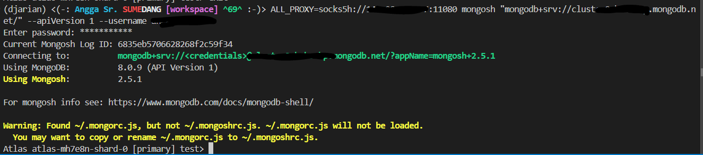
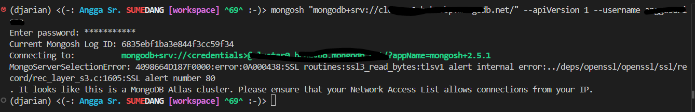

## Dockerfile

````
FROM alpine:latest
RUN apk update && apk add --no-cache dante-server
COPY danted.conf /etc/danted.conf
EXPOSE 1080
CMD ["sockd", "-f", "/etc/danted.conf"]
````

## danted.conf

````
logoutput: stderr
internal: 0.0.0.0 port = 1080
external: eth0

method: username none
user.notprivileged: nobody

client pass {
    from: 0.0.0.0/0 to: 0.0.0.0/0
    log: connect disconnect error
}

socks pass {
    from: 0.0.0.0/0 to: 0.0.0.0/0
    protocol: tcp udp
    log: connect disconnect error
}
````

## Build & Run Container (Di server yang di whitelist mongo atlas)
````
sudo docker build -t atlas-proxy:latest .
sudo docker run -d --name socks5 -p 1080:1080 atlas-proxy:latest
````

## Connect
````
ALL_PROXY=socks5h://<sock ip proxy server>:<port> mongosh "mongodb://<mongo uri>"
````

## Test
Test on linux, with proxy


without proxy
